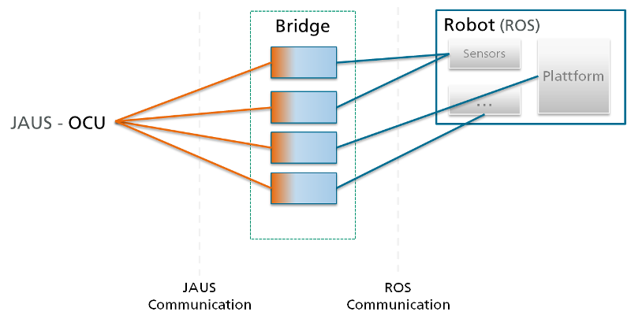
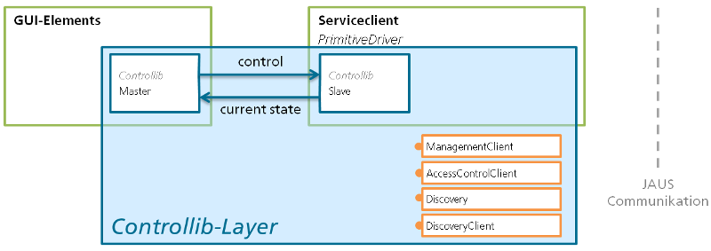

## How ROS/IOP-Bridge works - an overview

The ROS/IOP-Bridge consists of a lot of independent components. This components represent in case one the IOP components:
By **fkie_iop_component** it is now possible to configure the set of the services included into one component. All services of the ROS/IOP Bridge are implemented as a plugin. You can configure to use all services in one component or in a lot of independent components.

For the IOP-OCU it looks like IOP components, but in the background they use the ROS data.
In the second case the ROS/IOP-Bridge components are used on the OCU side to process the JAUS data and make it available for ROS-GUI, like rqt:

### Component structure
As an example we look at the PrimitiveDriver service plugin. This component is located in [iop_mobility](https://github.com/fkie/iop_jaus_mobility) and implemnents the translation of `SetWrenchEffort` and `ReportWrenchEffort` to ROS messages:

To reduce the implementation effort of included JAUS services like `AccessControl`, `Discovery` and other we implemented these as libraries wich are included by the component. Look at `package.xml` and `CMakeLists.txt` of `fkie_iop_primitive_driver` package to see how they can be included.

### Components on the OCU side
The ROS/IOP-Bridge components on the OCU side consume the JAUS data, e.g. of the PrimitiveDriver. This components are located in packages beginning with `iop_client_` prefix and include the client services for `AccessControl`, `Discovery` and other. Additionally, we created `fkie_iop_ocu_slavelib` and `fkie_iop_rqt_access_control` packages to control the independent client components simultaneously. This is useful to release or get access for a whole robot for example.

